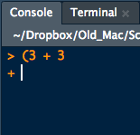

Introduction
================

[\<\<\< Previous](../README.md) | [Next \>\>\>](02-functions.md)

-----

> ## Learning Objectives
> 
>   - Describe the purpose of RStudio’s script, console, environment,
>     and file/plot/help windows.
>   - Create an R project.
>   - Organize files and directories for a set of analyses as an R
>     Project.
>   - Use the built-in RStudio help interface to search for more
>     information on R functions.

-----

# Presentation of RStudio

Start RStudio – Let’s start by learning about our tool.

  - Console, Scripts, Environments, Plots
  - Code and workflow are more reproducible if we can document
    everything that we do.
  - Our end goal is not just to “do stuff” but to do it in a way that
    anyone can easily and exactly replicate our workflow and results.

# Before we get started

  - Under the `File` menu, click on `New project`, choose `New
    directory`, then `Empty project`
  - Enter a name for this new folder, and choose a convenient location
    for it. This will be your **working directory** for the rest of the
    day (e.g., `~/intro-r`)
  - Confirm that the folder named in the `Create project as a
    sub-directory of` box is where you want the working directory
    created. Use the `Browse` button to navigate folders if changes are
    needed.
  - Click on “Create project”
  - In your terminal (tab on the bottom left), first make sure that
    you’re in your `~/intro-r` directory. If not, navigate there.
    Then, create a folder named `data` within your newly created working
    directory. (e.g., `~/intro-r/data`)
  - Create a new R script (File \> New File \> R script) and save it in
    your working directory (e.g. `intro-r-script.R`)

Your working directory should now look like this:


# Interacting with R

There are two main ways of interacting with R: using the console or by
using script files (plain text files that contain your code).

The console window (in RStudio, the bottom left panel) is the place
where R is waiting for you to tell it what to do, and where it will show
the results of a command. You can type commands directly into the
console, but they will be forgotten when you close the session. It is
better to enter the commands in the script editor, and save the script.
This way, you have a complete record of what you did, you can easily
show others how you did it and you can do it again later on if needed.
You can copy-paste into the R console, but the Rstudio script editor
allows you to ‘send’ the current line or the currently selected text to
the R console using the `Command-Enter` shortcut (`Ctrl-Enter` for PCs).

If R is ready to accept commands, the R console shows a `>` prompt. If
it receives a command (by typing, copy-pasting or sent from the script
editor using <kbd>Ctrl</kbd>-<kbd>Enter</kbd>), R will try to execute
it, and when ready, show the results and come back with a new `>` prompt
to wait for new commands.

If R is still waiting for you to enter more data because it isn’t
complete yet, the console will show a `+` prompt. It means that you
haven’t finished entering a complete command. This is because you have
not ‘closed’ a parenthesis or quotation. If you’re in Rstudio and this
happens, click inside the console window and press <kbd>Esc</kbd> or
`Ctrl-C`; this should help you out of trouble.

Try entering this into your console:

``` r
(3 + 3
```

Your console chould look like this:



If you keep pressing enter, more `+` will appear. To fix this, close the
parentheses with `)` to evaluate the expression, or <kbd>Esc</kbd> or
`Ctrl-C` to escape and leave the expression unevaluated.

# Basics of R

R is a versatile, open source programming/scripting language that’s
useful both for statistics but also data science.

  - **Open source** software under GPL.
  - R has over 7,000 user contributed packages at this time. It’s widely
    used both in academia and industry.
  - Available on all platforms.
  - Not just for statistics, but also general purpose programming.
  - For people who have experience in programmming: R is both an
    object-oriented and a so-called [functional
    language](http://adv-r.had.co.nz/Functional-programming.html)
  - Large and growing community of peers.

## Organizing your working directory

You should separate the original data (raw data) from intermediate
datasets that you may create for the need of a particular analysis. For
instance, you may want to create a `data/` directory within your working
directory that stores the raw data, and have a `data_output/` directory
for intermediate datasets and a `figure_output/` directory for the plots
you will generate later.

[\<\<\< Previous](../README.md) | [Next \>\>\>](02-functions.md)  
[Glossary](sections/glossary)

**Note**: The introductory material is copied and modified from [Data
Carpentry](http://datacarpentry.org).
<http://creativecommons.org/licenses/by/3.0/>. “Copyright (c) Data
Carpentry”
