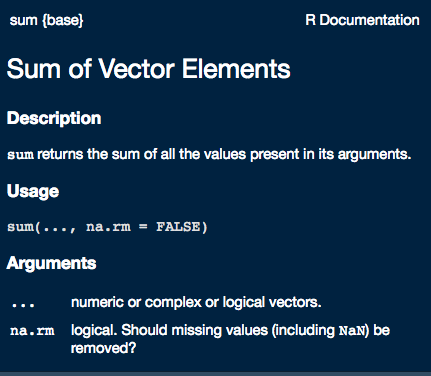
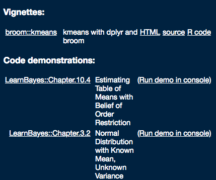
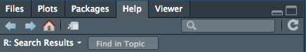
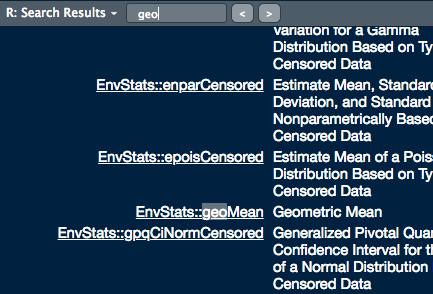
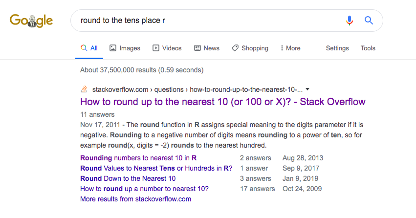
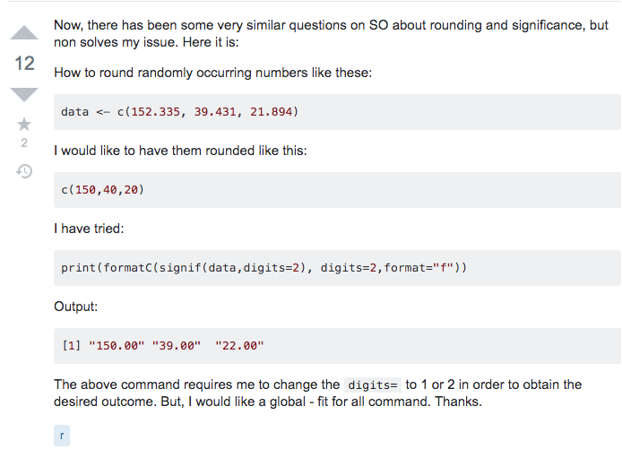
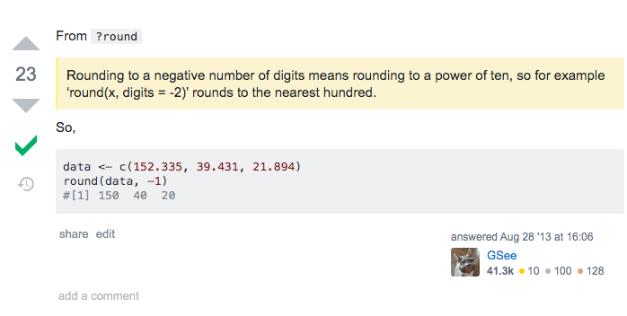

[<<< Previous](01-introduction.md) | [Next >>>](04-vectors.md)

```{r, echo=FALSE, results='hide'}
### This is some code I stole off of stackoverflow answer to limit the number of lines that get output from a chunk (https://stackoverflow.com/questions/23114654/knitr-output-hook-with-an-output-lines-option-that-works-like-echo-26/23147563#23147563)

library(knitr)
hook_output <- knit_hooks$get("output")
knit_hooks$set(output = function(x, options) {
  lines <- options$output.lines
  if (is.null(lines)) {
    return(hook_output(x, options))  # pass to default hook
  }
  x <- unlist(strsplit(x, "\n"))
  more <- "..."
  if (length(lines)==1) {        # first n lines
    if (length(x) > lines) {
      # truncate the output, but add ....
      x <- c(head(x, lines), more)
    }
  } else {
    x <- c(more, x[lines], more)
  }
  # paste these lines together
  x <- paste(c(x, ""), collapse = "\n")
  hook_output(x, options)
})
```


## Creating objects
You can get output from R simply by typing math in the console:

```{r}
5 * 30
2 / 3
```

However, you often need to save output or *values* to *objects*. Storing values in objects allows you to do interesting things with them later. To create an object, you pick a succinct, easy to remember name and then use the assignment operator ```<-``` to give the name a value. The format is ```name <- value```. The value on the right is assigned to the object on the left.

For instance:

```{r}
head_size <- 40
```

This statement can be interpreted as "40 **goes into** head_size". For historical reasons, you can also use ```=``` for assignments, but not in every context. Because ```=``` can throw unexpected results in some situations, it is good practice to always use ```<-``` for assignments.

**Quick tip**: In RStudio, typing <kbd>Alt</kbd> + <kbd>-</kbd> (push <kbd>Alt</kbd> at the same time as the <kbd>-</kbd> key) will write ```<-``` in a single keystroke in a PC, while typing <kbd>Option</kbd> + <kbd>-</kbd> (push <kbd>Option</kbd> at the same time as the <kbd>-</kbd> key) does the same in a Mac.

Objects can be given any name such as ```x```, ```body_size```, or ```signal_length```. You want your object names to be explicit and not too long. They cannot start with a number (```2x``` is not valid, but ```x2``` is). R is case sensitive (e.g., ```weight_kg``` is different from ```Weight_kg```). There are some names that cannot be used because they are the names of fundamental functions in R (e.g., `if`, `else`, `for`, see [here](https://stat.ethz.ch/R-manual/R-devel/library/base/html/Reserved.html) for a complete list). In general, even if it’s allowed, it’s best to not use other function names (e.g., `c`, `T`, `mean`, `data`, `df`, `weights`). If in doubt, check the help to see if the name is already in use. It’s also best to avoid dots (`.`) within an object name as in `my.data`. There are many functions in R with dots in their names for historical reasons, but because dots have a special meaning in R (for methods) and other programming languages, it’s best to avoid them. It is also recommended to use nouns for object names, and verbs for function names. It’s important to be consistent in the styling of your code (where you put spaces, how you name objects, etc.). Using a consistent coding style makes your code clearer to read for your future self and your collaborators. In R, three popular style guides are [Google’s](https://google.github.io/styleguide/Rguide.html), [Jean Fan’s](http://jef.works/R-style-guide/) and the [tidyverse’s](https://style.tidyverse.org/). The tidyverse’s is very comprehensive and may seem overwhelming at first. You can install the [lintr](https://github.com/jimhester/lintr) package to automatically check for issues in the styling of your code.

**Exercise 1**

Which of the following object names is *invalid*?

a) site_num

b) R2

c) 1st_try

d) fish.scale.size

You might have noticed that assigning a value to an object doesn't print anything. To print the value, you can either use parentheses around the assignment or type the object name:

```{r}
head_size <- 40 # doesn't print anything
(head_size <- 40) # prints output
head_size # prints output if you've already assigned a value to the object
```

Important aside: The comments written to the right of the hash mark don't get run as code. Using informative comments is good coding practice. Clear comments are essential for when you want someone else to run your code and be able to interpret what you're typing. In addition, they're critical for you to understand what you did when you have to read your code two months (*years*, *decades*) later. Clear comments should state what you are doing, define your objects, and clarify any non-standard code you may employ. Don't assume that you'll know what your code means down the line!

### Using objects

Okay, now that ```head_size``` is in memory, you can do things with it! Let's try some math.

```{r}
# take the square of head_size
head_size ** 2
```

Quick question- what is the value of head size now? Why do you think that is? Don't read ahead!

### Modifying objects

If you want to change an object's value, just assign it a new one. Your object's value doesn't change until a new assignment is made. R will not hesitate to overwrite the value, giving you no warnings when you are doing so. So, be careful and always double-check that the object doesn't already exist or you are sure in your intent to overwrite!

```{r}
# assign a new number
(head_size <- 45)

# assign a new value with arithmetic
(head_size <- head_size * 1.25)
```

**Exercise 2**

Create a new object called ```weight_kg``` and assign it the value **70**. Now, divide it by two and convert it to pounds, using the conversion factor **2.2**. Assign this new value to the object ```weight_lb```.


## Functions
When you want to make something happen in R, you can call a function. Most functions will produce results that you can see immediately, such as the ```sqrt()``` (square root) function in R. ```sqrt()``` is part of the base R package that comes with your installation of R. 

```{r}
sqrt(16)
```

You can think of functions as "canned scripts" that automate more complicated sets of commands. The structure of "calling" (or "running" or "executing") a function is:
```function(argument1, argument2, ...)```. Calling the function results in some sort of output. Functions can take one or a few inputs, or *arguments* (see below). The ```sqrt()``` function has one argument, which we supply the value **16** to. It outputs, or *returns*, a single numeric value. 

## Arguments
The input you provide for your function are called arguments. Some functions take a single argument while others take multiple.
```{r}
#Example of a function that takes a single argument:
factorial(3)

#Example of a function that takes multiple arguments:
paste("Hello", " World!", sep = "")
```

### args()
The ```args()``` function tells you what inputs, or *arguments* a function recognizes. 
```{r}
#For example:
args(round)
```

From the output of ```args(round)```, we know that this function takes 2 arguments, ```x``` and ```digits```. Looking at the help documentation (you'll learn how to access that in a second), the ```x``` argument requires a number or a set of numbers that you wish to round. The ```digits``` argument requires a whole number that determines the number of decimal places you want to round to. The ```= 0``` part of ```digits = 0``` denotes a default value. In this instance, the ```round()``` function will round to the first whole number if you don't supply the ```digits``` argument with a value.

**Exercise 3**

See what arguments are within the ```sum()``` function. One of them is ```...``` (ellipsis). Use Google to figure out what the ```...``` argument means.

### Matching arguments
You can also use the names of the arguments to specify the input. If you don't use argument names, R will match your inputs based on the order that they are written. 
```{r}
log(100, 10) 
#is different from 
log(10, 100)
```

Specifying your input with the argument names can help avoid potential errors.

```{r}
# both of these return the same value
log(x = 100, base = 10)
log(base = 10, x = 100)
```


### Default arguments
Some arguments are optional, such as ```base``` in ```log()```. In the case of an optional argument, you need not supply a value and the function will still run. In this case, the ```base``` argument has a default value of *exp(1)* and if you do not provide an alternative base value it will use its default value. However, the argument of ```x``` is not optional and requires an input or the function will not run.


### Code body
Typing the name of the function without the parentheses will return the code that is stored in the function. A couple examples of where this can be helpful are if you are performing a statistical test and you want to know exactly how R is performing the calculations, or you are looking for inspiration for writing your own functions.  Here is an example with the ```cor()``` function, which calculates correlations among variables. I restricted the output to only the first ten lines here- there is a lot of underlying code to calculate a correlation!
```{r, output.lines=10}
cor
```


## Getting help
I don't think I have ever had a coding session where I didn't have to get help at least once. Effectively getting help for a problem in R is a crucial skill. Programmers often joke that they don't actually code, they're just really good at using Google. While a bit of an exaggeration, this isn't far off from the truth. However, before jumping straight to Google, there are a few places within R and RStudio where you can get help.

Adding a ```?``` in front of a function will open up the documentation for that particular function. If you're using RStudio, it'll open in your help tab. It can help explain what that function can do and serves as a pretty useful help page when you are learning or troubleshooting.
```{r, eval=FALSE}
# you don't need the parentheses, but ?sum() also works
?sum
```

A typical help page has these sections: **Description**, **Usage**, **Arguments**, **Details**, **Value**, **S\* methods**, **References**, **See Also**, and **Examples**. 

The help page for ```sum()``` looks like this:



**Explore** 

Explore the ```sum()``` help page to get an idea of what a help page looks like. Feel free to look around at the help pages for different functions when you're comfortable with the **sum()** page.

Sometimes you may not know the exact name of the function you need help with or you only know the package it came in (we'll get to what a package is later. For now, think of it as a folder that holds a suite of functions). In this case, ```??``` is helpful. ```??``` executes a broader search of R, looking for functions and packages that contain your search terms. It will return **Vignettes**, **Code demonstrations**, and **Help pages** that contain your search term. 

Try this in your console:
```{r, eval=FALSE}
??mean
```

When I run it, I get this in my help tab. Yours will likely look different.



These vignettes, packages, and examples all involve the keyword *mean*. Sometimes the returned results are daunting and it could take a while to search through them if your search term is used in a lot of functions. A helpful aspect of RStudio is that you can search within your results with the "Find in Topic" search bar. 



For instance, I'm interested in calculating the geometric mean rather than the average, so I typed "geo" into the Find in Topic bar:



Depending on the function author, the help pages can either be very informative and clear, or they can be opaque. They may have plenty of information about one use of the function, but nothing about the use you're interested in. Maybe you're trying to run your function and a weird error message keeps popping up. Maybe you want to perform an analysis, but don't know which function(s) are appropriate. In this case, Google is your friend. In most cases, especially for beginners, your question has already been answered somewhere. The hard part is entering the correct search terms and knowing where quality answers are. 

I'll demonstrate a typical Google search here. 
You're interested in rounding a bunch of numbers to the nearest tens place (e.g. 46 rounds to 50), but the ```round()``` function appears to only round to digit values. You scanned the help page, but didn't notice anything that solves your problem. So, using your R googling skills, you search "round to the tens place r". R is sufficiently common that tacking on "r" or "r stats" to the end of the question is enough to find an R solution for your problem. 



This is a typical Google result for a coding problem. The first or second result will typically be a [stackoverflow](https://stackoverflow.com/) page. Stackoverflow is a forum for answering technical questions. The large result is typically what Google considers the most relevant, followed by smaller links that seem to match your search requirement. 

**Quick question**

Type the search string into your own console and click on this result. Does this seem like a good solution to your problem? Why or why not?

**Quick answer**
Unfortunately this isn't what you're interested in. This user is seeking to only round up. The next google selection looks promising! Click on the "Rounding numbers to nearest 10 in R" link. 

The questions looks like this:



The user has a similar goal to you- they want to round to the 10s place. Note that they provide examples of what they would like to see and have stated what they have tried already!

Now how to find the right answer? Fortunately, this question only has two answers to sift through. Usually the best answer is the answer accepted by the author (with the green checkmark), but sometimes the author doesn't select a top answer or the community disagrees with the question author's selection. It's worth it to take a look at other highly upvoted answers so you don't miss anything! In this case, we have a straightforward decision. The top answer is this:



Well, this is embarrassing. The answer was in the help documentation! Don't feel embarrassed though. Be glad the answer was simple. 

Asking good questions and assessing quality answers is a skill that takes a while to develop (at least it did for me). However, it is one of the most important skills to develop. Check out [this post](https://stackoverflow.com/help/how-to-ask) for a short and sweet overview of how to ask good questions in forums like stackoverflow. Google has another [good blog post](https://webmasters.googleblog.com/2010/09/tips-for-getting-help-with-your-site.html) that should get you started asking good questions! 

### More help resources
Here are some more resources to help you get help.

[How to make a reproducible example](https://www.tidyverse.org/help/)

[The RStudio community for help with RStudio products, tidyverse, and more](https://community.rstudio.com/)

I'll probably link to this book many times, but [R for Data Science](https://r4ds.had.co.nz/) is a great reference.

## Answers

**Exercise 1** 

3) 1st_try. Names can't start with a number

**Exercise 2**

Here is one method:
```{r}
weight_kg <- 70
weight_kg <- 70 / 2
weight_lb <- weight_kg * 2.2
```

Here's another:
```{r}
weight_kg <- 70
weight_lb <- (70 / 2) * 2.2
```

Note that I used parentheses around the first operation. You can use parantheses to specify the order you want operations to be performed. R follows the order of operations, so the parentheses aren't really necessary here, but they can be helpful to clarify your code or prevent mistakes.

**Exercise 3**

```{r}
args(sum)
```

From [this blog post](https://www.r-bloggers.com/r-three-dots-ellipsis/): "...it means that the function is designed to take any number of named or unnamed arguments."


Material modified from [R Studio Primers](https://rstudio.cloud/learn/primers) and [Data Carpentry](https://datacarpentry.org/R-ecology-lesson/01-intro-to-r.html)

[<<< Previous](01-introduction.md) | [Next >>>](04-vectors.md)   
