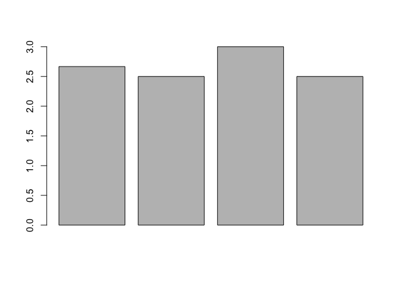

Data types
================

[\<\<\< Previous](04-vectors.md) | [Next \>\>\>](06-data-structure.md)

## Data types

R interprets the type of your vector based on the characteristics of its
values. For instance, R can do math with vectors that contain numerical
data:

``` r
nums <- c(1, 2, 3)

nums * 2
```

    ## [1] 2 4 6

If you have a vector of character strings, R can count the number of
characters in each string:

``` r
sentence <- c("I", "love", "to", "code", "in", "R.")

nchar(sentence)
```

    ## [1] 1 4 2 4 2 2

You can combine vectors of the same data type using the `c()` function.
This is very useful when you need want to combine vectors. For instance,
you may obtain vectors from two different data sets that you want to
combine for a single analysis.

``` r
sentence_2 <- c("But", "Python", "is", "ok", "too.")

c(sentence, sentence_2)
```

    ##  [1] "I"      "love"   "to"     "code"   "in"     "R."     "But"    "Python"
    ##  [9] "is"     "ok"     "too."

Each *data type* has its own unique properties.

Here is a list of the different data types:

  - `int` stands for integers, or whole numbers.

  - `dbl` stands for doubles, or numbers with decimals.

  - `chr` stands for character vectors, or strings.

  - `dttm` stands for date-times (a date + a time).

  - `lgl` stands for logical, vectors that contain only TRUE or FALSE.

  - `fctr` stands for factors, which R uses to represent categorical
    variables with fixed possible values.

  - `date` stands for dates.

## typeof()

`typeof()` is a handy function that returns the data type of your
vector. If you’re ever in doubt, check your vector with `typeof()`\!

``` r
dec <- c(3.24, 5.4, 2.04, 6.55)

typeof(dec)
```

    ## [1] "double"

## Getting it right

Vectors cannot contain more than one type of data. If you try, R will
coerce your vector to a single data type that you weren’t intending.

``` r
mix_vec <- c(1, "two", 3L)

mix_vec
```

    ## [1] "1"   "two" "3"

``` r
typeof(mix_vec)
```

    ## [1] "character"

**Exercise 1**. Answers at the bottom.

You’re interested in whether modern Western households stick to the
“three meals a day” norm that has persisted since the middle ages.
Work demands have increased and you think that people may be sherking a
meal in favor of more work time. In a preliminary survey of your
apartment complex, you surveyed four households and asked how many meals
each member consumes on average each day.

Complete the following to analyze your preliminary data.

1)  Check your data vectors to make sure you are indeed working with
    numeric data.

<!-- end list -->

``` r
# hh = household
hh_1 <- c(2, 3, 3)
hh_2 <- c(3, 2, 2, 3)
hh_3 <- c(2, 4)
hh_4 <- c(3, 2)
```

2)  Take the average of each household using the `take_avg()` function
    you created earlier. Assign each one to a unique object.
3)  Create a new vector of your averages.
4)  Visualize your new household averages using the `barplot()`
    function. Just put your object from step 3) inside the function,
    e.g. `barplot(hh_averages)`.
5)  Since you’re interested in average across households, take the
    average of your household averages. What does your preliminary
    survey tell you?

## Exercise Answers

**Exercise 1**

1)  
<!-- end list -->

``` r
typeof(hh_1)
## [1] "double"
typeof(hh_2)
## [1] "double"
typeof(hh_3)
## [1] "double"
typeof(hh_4)
## [1] "double"
```

2)  
<!-- end list -->

``` r
hh_avg_1 <- take_avg(hh_1)
hh_avg_2 <- take_avg(hh_2)
hh_avg_3 <- take_avg(hh_3)
hh_avg_4 <- take_avg(hh_4)
```

3)  
<!-- end list -->

``` r
all_avgs <- c(hh_avg_1, hh_avg_2, hh_avg_3, hh_avg_4)
all_avgs
```

    ## [1] 2.666667 2.500000 3.000000 2.500000

4)  
<!-- end list -->

``` r
barplot(all_avgs)
```

<!-- -->

5)  
<!-- end list -->

``` r
take_avg(all_avgs)
```

    ## [1] 2.666667

[\<\<\< Previous](04-vectors.md) | [Next \>\>\>](06-data-structure.md)  
[Glossary](glossary.md)
