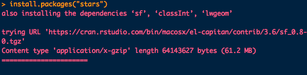
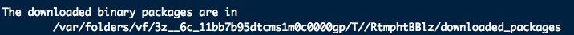
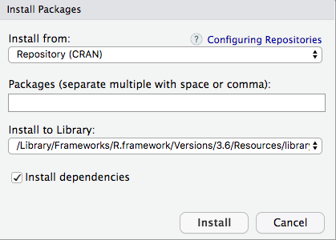
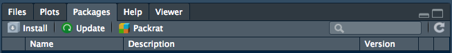

[<<< Previous](06-data-structure.md) | [Next >>>](08-importing-data.md)   

R packages are collections of functions and data sets developed by the community. They increase the power of R by improving existing base R functionalities, or by adding new ones. 

## What is a package?

A package is a suitable way to organize your own work and, if you want to, share it with others. Typically, a package will include code (not only R code!), documentation for the package and the functions inside, some tests to check everything works as it should, and data sets.

The basic information about a package is provided in the DESCRIPTION file, where you can find out what the package does, who the author is, what version the documentation belongs to, the date, the type of license its use, and the package dependencies.

Besides finding the DESCRIPTION files on websites like cran.r-project.org or stat.ethz.ch, you can also access the description file inside R with the command ```packageDescription("package")```, via the documentation of the package ```help(package = "package")```, or online in the repository of the package.

For example, for the “stats” package, these ways will be:

```{r, eval=FALSE}
packageDescription("stats")
help(package = "stats")
```

## What are repositories?

A repository is a place where packages are located so you can install them from it. Although you or your organization might have a local repository, typically they are online and accessible to everyone. Three of the most popular repositories for R packages are:

[CRAN](https://cran.r-project.org/): the official repository, it is a network of ftp and web servers maintained by the R community around the world. The R foundation coordinates it, and for a package to be published here, it needs to pass several tests that ensure the package is following CRAN policies. You can find more details here.

[Bioconductor](https://www.bioconductor.org/): this is a topic specific repository, intended for open source software for bioinformatics. As CRAN, it has its own submission and review processes, and its community is very active having several conferences and meetings per year.

[Github](github.com) : although this is not R specific, Github is probably the most popular repository for open source projects. Its popularity comes from the unlimited space for open source, the integration with git, a version control software, and its ease to share and collaborate with others. But be aware that there is no review process associated with it.

## Installing packages from CRAN

How you can install a package will depend on where it is located. So, for publicly available packages, this means to what repository it belongs. The most common way is to use the CRAN repository, then you just need the name of the package and use the command

```{r, eval=FALSE}
install.packages("package")
```


Since the wifi isn't great, we're not going to try out installing a package here. When you install a package, a long list of messages will output to your console. These are the messages of the installation itself, the source code, the help, some tests, and finally, a message that everything went well and the package was successfully installed. Depending on what platform you are, these messages can differ.

Here are a couple examples of output from a recent package installation. Some packages have other packages that they depend on that need to be downloaded first, which is what you are seeing in the first image. The second image shows the convoluted path your package is downloaded to. You can specify custom paths where you want to install packages, but it can be a headache to keep up with.





Finally, to install more than a package at a time, just write them as a character vector in the first argument of the ```install.packages()``` function:

```{r, eval=FALSE}
install.packages(c("stars", "sf"))
```


### Installing from CRAN mirrors
Remember that CRAN is a network of servers (each of them called a “mirror”), so you can specify which one you would like to use. If you are using R through the RGui interface, you can do it by selecting it from the list which appears just after you use the ```install.packages()``` command. On RStudio, the mirror is already selected by default.

You can also select your mirror by using the ```chooseCRANmirror()```, or directly inside the ```install.packages()``` function by using the repo parameter. You can see the list of available mirrors with ```getCRANmirrors()```.

## Installing packages via devtools

As you have read above, each repository has its own way to install a package from them, so in the case that you are regularly using packages from different sources, this behavior can be a bit frustrating. A more efficient way is probably to use the ```devtools``` package to simplify this process, because it contains specific functions for each repository, including CRAN.

You can install ```devtools``` as usual with ```install.packages("devtools")```, but you might also need to install Rtools on Windows, Xcode command line tools on Mac, or r-base-dev and r-devel on Linux. 

After devtools is installed, you will be able to use the utility functions to install another packages. The options are:

* ```install_bioc()``` from Bioconductor,
* ```install_bitbucket()``` from Bitbucket,
* ```install_cran()``` from CRAN,
* ```install_git()``` from a git repository,
* ```install_github()``` from GitHub,
* ```install_local()``` from a local file,
* ```install_svn()``` from a SVN repository,
* ```install_url()``` from a URL, and
* ```install_version()``` from a specific version of a CRAN package.

For example, to install the [babynames package](https://github.com/hadley/babynames) from its Github repository, you can use:

```{r, eval=FALSE}
devtools::install_github("hadley/babynames")
```

To save bandwidth, don't install it during the workshop.

## How to update, remove, and check installed packages

After you spend more time with R, it is normal that you use install.packages() a few times per week or even per day, and given the speed at what R packages are developed, is possible that sooner than later you will need to update or replace your beloved packages. In this section, you will find a few functions that can help you to manage your collection.

* To check what packages are installed on your computer, you can use:

```{r, eval=FALSE}
installed.packages()
```

* To uninstall a package:

```{r, eval=FALSE}
remove.packages()
```

* You can check what packages need an update with a call to the function:

```{r, eval=FALSE}
old.packages()
```

* You can update all packages with:

```{r, eval=FALSE}
update.packages()
```

* To update a specific package, just use ```install.packages()``` again:

```{r, eval=FALSE}
install.packages()
```


## Installing packages with RStudio

RStudio has a nice graphical user interface for installing packages. You'll find it in the toolbar, at Tools -> Install Package. There you will get a pop-up window to type the package you want to install:



You can also find it in under the packages pane in your RStudio window.



## How to load packages

After a package is installed, you are ready to use its functionalities. If you just need a sporadic use of a few functions or data inside a package you can access them with the notation ```packagename::functionname()```. The pre-workshop instructions had you install the ```tidyverse``` package. It turns out, the ```tidyverse``` package contains a number of other packages suitable for data science. You're going to take a look at one of the data sets loaded in the ```dplyr``` package. But first, an exercise.

**Exercise 1**

Do you remember how to see an overview of what functions and data are contained in a package? Try this with ```dplyr```.

To access the band instruments dataset inside the ```dplyr``` package you just type:

```{r}
dplyr::band_instruments
```

If you will make a more intensive use of the package, then maybe is worth to load it into memory. The simplest way to do this is with the ```library()``` command. Unfortunately, you can only load one package at a time with ```library()```. 

Please note that the input of ```install.packages()``` is a character vector and requires the name to be in quotes, while ```library()``` accepts either character or name and makes it possible for you to write the name of the package without quotes.

After this, you no longer need the ```package::function()``` notation, and you can access directly its functionalities as any other R base functions or data:

```{r, warning=FALSE, message=FALSE}
library(dplyr)
band_instruments
```

Sometimes packages share function names with each other. For instance, both the dplyr and raster packages have a ```select()``` function. 
So I don't confuse which package a function is being used from, I'll explicitly designate the package with ```dplyr::select()``` or ```raster::select()```. It's a good habit to get into, even if it requires more typing.

There is also the ```require()``` function: it is indeed possible to load a package with this function, but the difference is that it will not throw an error if the package is not installed.

So use this function carefully!

For a more in-depth view on why you want to use ```library()``` instead of ```require()```, read [this article](https://yihui.org/en/2014/07/library-vs-require/). 


### Unloading a package

To unload a given package, you can use the ```detach()``` function:

```{r, eval=FALSE}
detach("package:dplyr", unload = TRUE)
```

## Vignettes

Another very useful source of help included in most of the packages are the vignettes, which are documents where the authors show some functionalities of their package in a more detailed way. Following vignettes is a great way to get your hands dirty with the common uses of the package, so it's a perfect way to start working with it before doing your own analysis.

As you might remember, the information of vignettes contained in a given package is also available in its DOCUMENTATION file locally or online, but you can also obtain the list of vignettes included in your installed packages with the function ```browseVignettes()```, and for a given package just include its name as a parameter: ```browseVignettes(package="packagename")```. In both cases, a browser window will open so you can easily explore and click on the preferred vignette to open it.

If you prefer to stay in the command line, the ```vignette()``` command will show you the list of vignettes, ```vignette(package = "packagename")```, the ones included in a given package, and after you have located the one you want to explore, just use the ```vignette("vignettename")``` command.

One package you will use extensively in the Data Visualization workshop is ```ggplot2```. By installing the ```tidyverse``` package, you have already installed ```ggplot2```. 

You can check what vignettes are included in it:

```{r, eval=FALSE}
vignette(package = "ggplot2")
```

Two vignettes are available for ```ggplot2```, “ggplot2-specs” and “extending-ggplot2”. You can check the first one with:

```{r, eval=FALSE}
vignette("ggplot2-specs")
```

On RStudio, this will be displayed on the Help tab, while in the RGui or on the command line this will open a browser window with the vignette

## Discovering R packages

Really, I find most of my R packages through Googling a specific task, following data scientists on Twitter, data science tutorials, or talking to friends. BUT the CRAN repository can make this simpler with the [CRAN task views](https://cran.r-project.org/web/views/). Packages are grouped by themes or categories that group packages based on their functionality. It's a super helpful resource that I wish I would remember more. Here's a list of some of the topics:


## The tidyverse

For the rest of the Intro to R workshop and the next two workshops, you are going to work with the **tidyverse** ecosystem of R packages. From the [website](https://www.tidyverse.org/): "The tidyverse is an opinionated collection of R packages designed for data science. All packages share an underlying design philosophy, grammar, and data structures." Each package within this ecosystem work seemlessy together to make data science tasks like data import, tidying, manipulation, visualisation, and programming more accessible while retaining performance. A number of packages exist in the tidyverse, but here are a few that we will use:

* [readr](https://readr.tidyverse.org/) for importing data,

* [dplyr](https://dplyr.tidyverse.org/) and [tidyr](https://tidyr.tidyverse.org/) for manipulating data, and

* [ggplot2](https://ggplot2.tidyverse.org/) for visualizing data

The packages are focused on performing each step leading up to modeling and communicating in the data science framework outlined in [R for Data Science](https://r4ds.had.co.nz/)


There is a short, easy to read [paper](https://tidyverse.tidyverse.org/articles/paper.html) now out on the tidyverse and tidy principles that I encourage you to read! For now, suffice it to say that the tidyverse makes working in R easier to learn and more human readable, so we're using it for these workshops.

### Wrap up challenge

**Exercise 2**

Another package in the ```tidyverse``` ecosystem is the ```tidyr``` package. We will explore this package in the Data Wrangling workshop. Let's take a quick glance to get a feel for it. 

1) Read the DESCRIPTION file for ```tidyr``` to get an idea of what it contains.

2) Load the package into your R session.

3) Get help for one of the functions to see what it does.

4) Skim the "Pivoting" vignette to get a feel of what a vignette contains.


## Answers

**Exercise 1**

```{r, eval=FALSE}
help(package = "dplyr")
```

**Exercise 2**

1) First use:
```{r, eval=FALSE}
help(package = "tidyr")
```

Then, click on the "DESCRIPTION file." link.

2) 
```{r, eval=FALSE}
library(tidyr)
```

3) To see the different functions available, look at the help page. Another trick I'll use if I can't quite remember the name of a function is type ```tidyr::``` into the console and scroll through the suggested packages.

Here's an example of getting help for a specific function:

```{r, eval=FALSE}
?tidyr::pivot_longer
```

Or, since the package is loaded:

```{r, eval=FALSE}
?pivot_longer
```


4) 
You can either navigate to the "User guides, package vignettes and other documentation." link on the help page, or use this:

```{r, eval=FALSE}
browseVignettes(package = "tidyr")
```


Much of the source material for this section comes from [this Data Camp article](https://www.datacamp.com/community/tutorials/r-packages-guide).

[<<< Previous](06-data-structure.md) | [Next >>>](08-importing-data.md) 