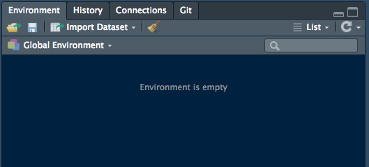
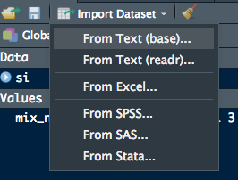
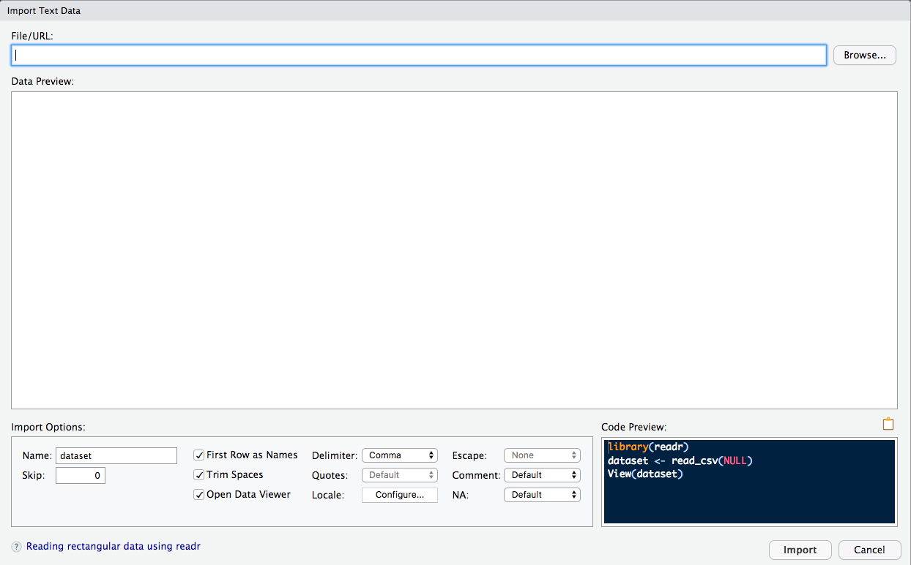

Importing data
================

[\<\<\< Previous](07-packages.md) | [Next \>\>\>]()

Unless you are generating your own data in R, you need to import it from
another source. This can either be straightforward or can be a huge
headache, depending on the source and format. For this section, you’ll
run through a few different ways to import data, and I’ll point you
towards some resources for the rest.

## Reading in rectangular data

The most common data format you’ll read in is a rectangular, plain-text
file (e.g. a simple spreadsheet). These are often delimited in a variety
of ways, depending on where the data was collected (e.g. Europe
vs. United States), what software was used to record the data, etc.
Fortunately, reading this type of data is straightforward. Base R has
its own functions to read in rectangular data, but we will use the
`readr` package from the `tidyverse` ecosystem because it is faster
(important for larger data sets), doesn’t make assumptions about your
data, and outputs tibbles. More detail about why is available below in
the **Compared to base R** section.

Here is a list of common data formats and the `readr` functions you can
use to read them in. In bold are common extensions used for these files.
You’ll get some practice with a couple of these in a bit.

  - `read_csv()` reads comma-delimited files. **.csv** **.txt**

  - `read_csv2()` reads semicolon separated files (common in countries
    where **,** is used as the decimal place). **.csv** **.txt**

  - `read_tsv()` reads tab-delimited files. **.tsv** **.txt**

  - `read_text()` reads in space-delimited files. **.txt**

  - `read_delim()` reads in files with any delimiter (you specify it
    within the function). **.txt**

`readr` contains some more functions to read in other forms of
rectangular data that are less common. Check out the help page to see
what those are\!

Now let’s get our hands dirty. First, load the `readr` package.

``` r
library(readr)
```

We’re going to focus on the `read_csv()` function because all `read_*`
functions have similar arguments.

One neat feature of the `read_*` set of functions is that they can
download files from the internet (assuming you have access to the file).
Crossing our fingers that the wi-fi is working, run this line of code:

``` r
#df <- read_csv("insert_online_path_here")
```

If that doesn’t work, run this function to write a small version of the
online file to your `data` folder. This highlights another useful R
feature- you can write files to your machine\! This means that you never
have to alter your original files. Any time you make changes to your
data set that you would like to keep or you create new output that you’d
like to save, you can write it to your machine as its own file.

``` r
write_csv(
  
)
```

Now, read that file in.

``` r
#df <- read_csv("file_path_here")
```

You should see something like this printed to your console (fewer rows
if you read in the small version). INSERT IMAGE OF CONSOLE HERE

When you run `read_csv()` it prints out a column specification that
gives the name and type of each column.

You can also supply an inline csv file. This is useful for experimenting
with `readr` and for creating reproducible examples to share with
others:

``` r
read_csv("a,b,c
1,2,3
4,5,6")
```

    ## # A tibble: 2 x 3
    ##       a     b     c
    ##   <dbl> <dbl> <dbl>
    ## 1     1     2     3
    ## 2     4     5     6

In both cases `read_csv()` uses the first line of the data for the
column names, which is a very common convention. There are two cases
where you might want to tweak this behaviour:

1)  Sometimes there are a few lines of metadata at the top of the file.
    You can use `skip = n` to skip the first `n` lines; or use `comment
    = "#"` to drop all lines that start with (e.g.) `#`.

<!-- end list -->

``` r
read_csv("The first line of metadata
  The second line of metadata
  x,y,z
  1,2,3", skip = 2)
```

    ## # A tibble: 1 x 3
    ##       x     y     z
    ##   <dbl> <dbl> <dbl>
    ## 1     1     2     3

``` r
read_csv("# A comment I want to skip
  x,y,z
  1,2,3", comment = "#")
```

    ## # A tibble: 1 x 3
    ##       x     y     z
    ##   <dbl> <dbl> <dbl>
    ## 1     1     2     3

2)  The data might not have column names. You can use `col_names =
    FALSE` to tell `read_csv()` not to treat the first row as headings,
    and instead label them sequentially from X1 to Xn:

<!-- end list -->

``` r
read_csv("1,2,3\n4,5,6", col_names = FALSE)
```

    ## # A tibble: 2 x 3
    ##      X1    X2    X3
    ##   <dbl> <dbl> <dbl>
    ## 1     1     2     3
    ## 2     4     5     6

(“\\n” is a convenient shortcut for adding a new line)

Alternatively you can pass `col_names` a character vector which will be
used as the column names:

``` r
read_csv("1,2,3\n4,5,6", col_names = c("x", "y", "z"))
```

    ## # A tibble: 2 x 3
    ##       x     y     z
    ##   <dbl> <dbl> <dbl>
    ## 1     1     2     3
    ## 2     4     5     6

Another option that commonly needs tweaking is `na`: this specifies the
value (or values) that are used to represent missing values in your
file. In this file, periods (“.”) are used to denote missing values. R
doesn’t know this automatically, so we need to specify it:

``` r
read_csv("a,b,c\n1,2,.", na = ".")
```

    ## # A tibble: 1 x 3
    ##       a     b c    
    ##   <dbl> <dbl> <lgl>
    ## 1     1     2 NA

This is all you need to know to read \~75% of CSV files that you’ll
encounter in practice. You can also easily adapt what you’ve learned to
read tab separated files with `read_tsv()`.

### Compared to base R

If you’ve used R before, you might wonder why we’re not using
read.csv(). There are a few good reasons to favour readr functions over
the base equivalents:

  - They are typically much faster (\~10x) than their base equivalents.
    Long running jobs have a progress bar, so you can see what’s
    happening. If you’re looking for raw speed, try
    `data.table::fread()`. It doesn’t fit quite so well into the
    tidyverse, but it can be quite a bit faster.

  - They produce tibbles, they don’t convert character vectors to
    factors, use row names, or munge the column names. These are common
    sources of frustration with the base R functions.

  - They are more reproducible. Base R functions inherit some behaviour
    from your operating system and environment variables, so import code
    that works on your computer might not work on someone else’s.

### Exercises

**Exercise 1**

What function would you use to read a file where fields were separated
with “|”?

**Exercise 2**

Identify what is wrong with each of the following inline CSV files. What
happens when you run the code?

1)  
<!-- end list -->

``` r
read_csv("a,b\n1,2,3\n4,5,6")
```

2)  
<!-- end list -->

``` r
read_csv("a;b\n1;3")
```

## Reading in other types of data

Sometimes you may need to import non-rectangular data or proprietary
data formats. We could make an entire three-day workshop on importing
other types of data, so I will just list them here. These are all
packages within the tidyverse that are pretty solid.

For rectangular data:

  - [haven](https://github.com/tidyverse/haven) reads SPSS, Stata, and
    SAS files.

  - [readxl](https://readxl.tidyverse.org/) reads excel files (both
    **.xls** and **.xlsx**).

  - [odbc](https://db.rstudio.com/odbc/), along with a database specific
    backend (e.g. RMySQL, RSQLite, RPostgreSQL etc) allows you to run
    SQL queries against a database and return a data frame.

For hierarchical data:

  - [jsonlite](https://github.com/jeroen/jsonlite) for the
    headache-inducing json format

  - [xml2](https://xml2.r-lib.org/) for the equally frustrating xml
    format

Hierarchical data sometimes requires more advanced programming knowledge
to wrangle it into a tidy data frame. Fortunately, Jenny Bryan has some
great worked examples on her [purrr tutorial
page](https://jennybc.github.io/purrr-tutorial/index.html), under the
“Worked examples” section. We will touch on some concepts related to
wrangling hierarchical data in the Data Wrangling workshop, but
hierarchical data deserves it’s own set of workshops to understand.

## Reading in with RStudio

I saved the easy part for the end because most data importing is going
to require some code and it’s important to understand what goes on under
the hood. However, RStudio does have a nice utility for importing a
variety of data formats.

First, navigate to your Environment pane.



Click on the “Import Dataset” tab and you should see this dropdown menu:



Click what type of file you are importing –I chose “From Text (readr)”–
and a screen like this should appear:



It’s as easy as browsing to your desired file and clicking “Import”\!
This does have some nice features. There is a Preview pane to get a
quick look at your data. There are Import Options on the bottom that
reflect arguments you would typically supply to the `read_csv()`
function (or whatever function is being used). My favorite part of this
feature is the Code Preview in the bottom right corner. Copying and
pasting that into your R script will make your data import decisions
more reproducible.

## Answers

**Exercise 1**

``` r
read_delim()
```

Specifically,

``` r
read_delim("file.txt", delim = "|")
```

**Exercise 2**

1)  This is the output you should expect:

<!-- end list -->

    ## Warning: 2 parsing failures.
    ## row col  expected    actual         file
    ##   1  -- 2 columns 3 columns literal data
    ##   2  -- 2 columns 3 columns literal data

    ## # A tibble: 2 x 2
    ##       a     b
    ##   <dbl> <dbl>
    ## 1     1     2
    ## 2     4     5

`read_csv()` expected three column names, but it was only provided with
two.

2)  This is the output you should expect:

<!-- end list -->

    ## # A tibble: 1 x 1
    ##   `a;b`
    ##   <chr>
    ## 1 1;3

R didn’t throw up an error, but the output isn’t as expected. “a” and
“b” should be separate columns, with “1” and “3” as their values.
This is a case of using the wrong function. Since the columns are
delimited by semicolons, we should use `read_csv2()`, like this:

``` r
read_csv2("a;b\n1;3")
```

    ## Using ',' as decimal and '.' as grouping mark. Use read_delim() for more control.

    ## # A tibble: 1 x 2
    ##       a     b
    ##   <dbl> <dbl>
    ## 1     1     3

Some of the source material for this section comes from Hadley Wickham’s
[R for Data Science](https://r4ds.had.co.nz/).

[\<\<\< Previous](07-packages.md) | [Next \>\>\>]()  
